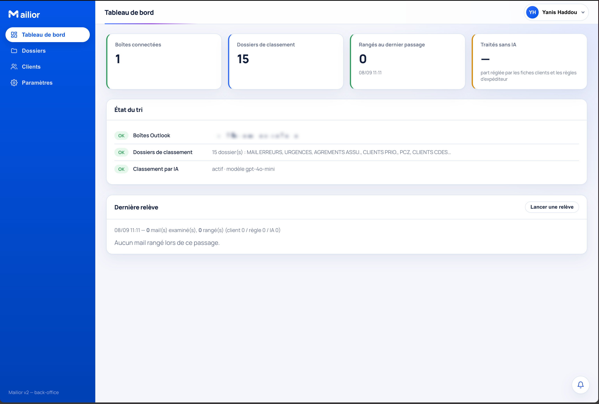
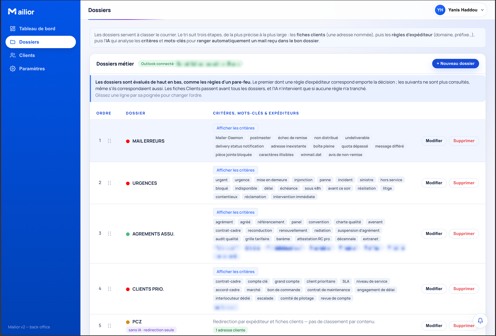

# Preuves — Agent de tri de courriels

Deux captures de l'outil en fonctionnement, prises pendant le stage.
Les adresses de boîtes ont été floutées avant publication.

## Tableau de bord

*Boîtes connectées, dossiers de classement, nombre de courriels rangés
au dernier passage, et part réglée par les fiches clients et les règles
d'expéditeur plutôt que par l'IA.*

## Règles de classement

*Les dossiers sont évalués de haut en bas, comme les règles d'un
pare-feu : le premier dont une règle d'expéditeur correspond emporte la
décision, et les suivants ne sont plus consultés. Les fiches clients
passent avant tous les dossiers ; l'IA n'intervient que si aucune règle
n'a tranché.*

## Ce que ces captures ne montrent pas

- le modèle de données (douze tables) — **à ajouter** : un schéma relationnel
- le chiffrement AES-256 — **à ajouter** : un extrait de code commenté
- la gestion des rôles et l'espace RGPD — **à ajouter** : une capture
