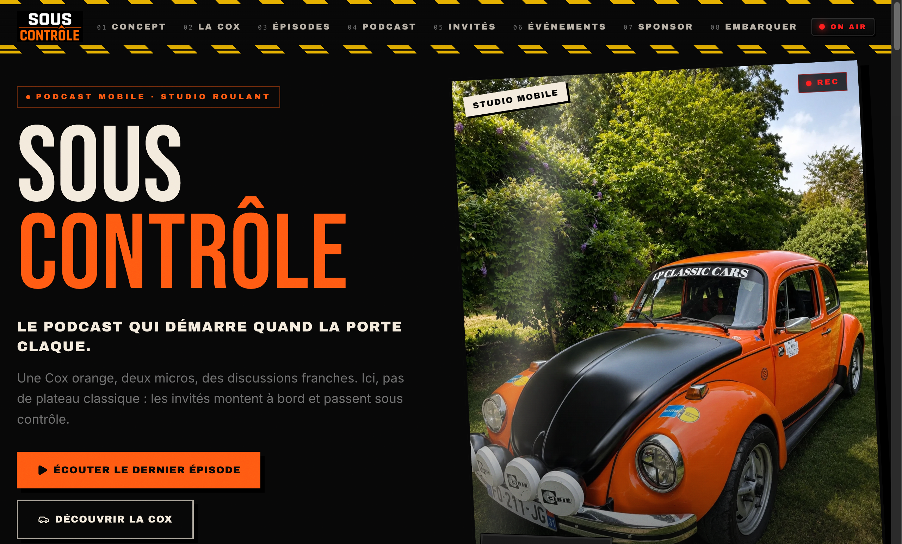
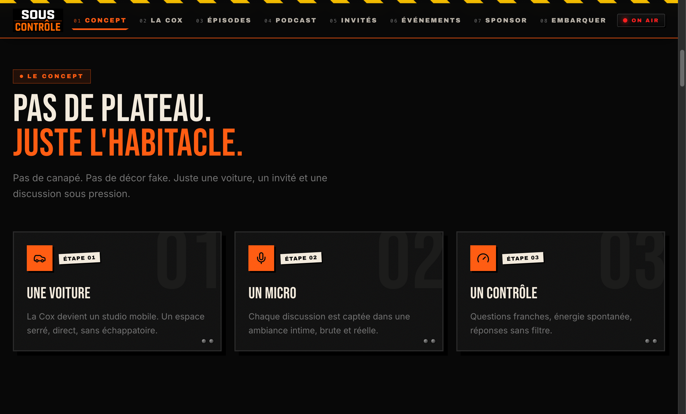
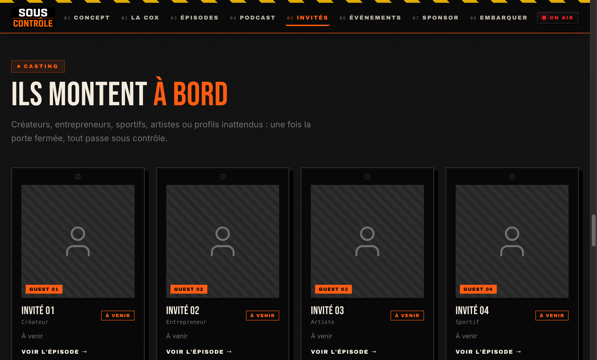

# Preuves — Mise en ligne d'un site public : référencement, pages légales et durcissement

✅ **Existe** — vérifié :

- [x] [Rapport SEO](https://yanis-haddou.vercel.app/documents/terminal-rapport-seo.pdf) — 1,9 Mo, répond en ligne
- [x] Cinq captures du site du podcast, publiées sur [https://yanis-haddou.vercel.app/stages](https://yanis-haddou.vercel.app/stages)
- [x] Pages légales en production
- [x] Durcissement : CSRF, webhook signé, anti-spam, CSP — semaine 5

À ajouter si possible : une capture avant / après du référencement, ou les positions mesurées.

## Aperçu visuel

*L'accueil : le concept en une phrase, et l'accès au dernier épisode.*

*La fiche du studio mobile — une Cox orange équipée de deux micros.*

*La section casting, en attente de ses premiers épisodes.*
