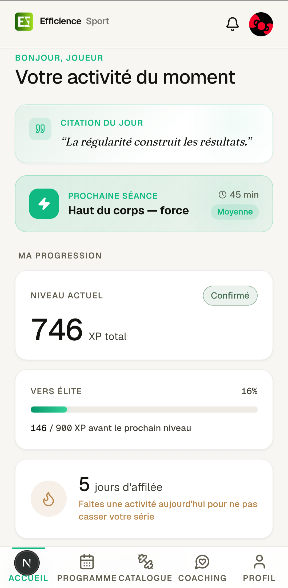

# Preuves — Fiabilisation d'un environnement de production : contrôle des variables d'environnement et optimisation de la base

⚠️ **C'est la seule semaine du stage sans aucune capture dans le portfolio** (semaine 1 : 9, semaine 3 : 2, semaine 4 : 4, semaine 5 : 8, semaine 2 : 0). À produire avant la soutenance :

- [ ] `.env.example` anonymisé, listant les variables attendues
- [ ] Extrait commenté du code de contrôle au démarrage
- [ ] **Capture du message d'erreur quand une variable manque** — la preuve la plus parlante : elle montre le comportement, pas l'intention
- [ ] Avant / après de l'optimisation de la base, si une mesure existe

## L'application concernée

*L'application dont l'environnement de production a été fiabilisé. Cette
capture montre ce qui tournait, pas le travail lui-même — les preuves du
contrôle au démarrage restent à produire.*
