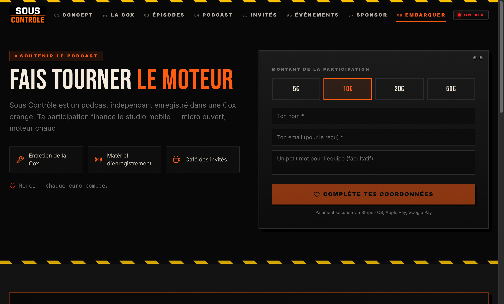
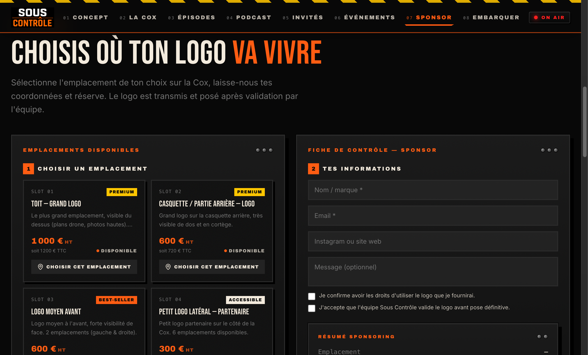
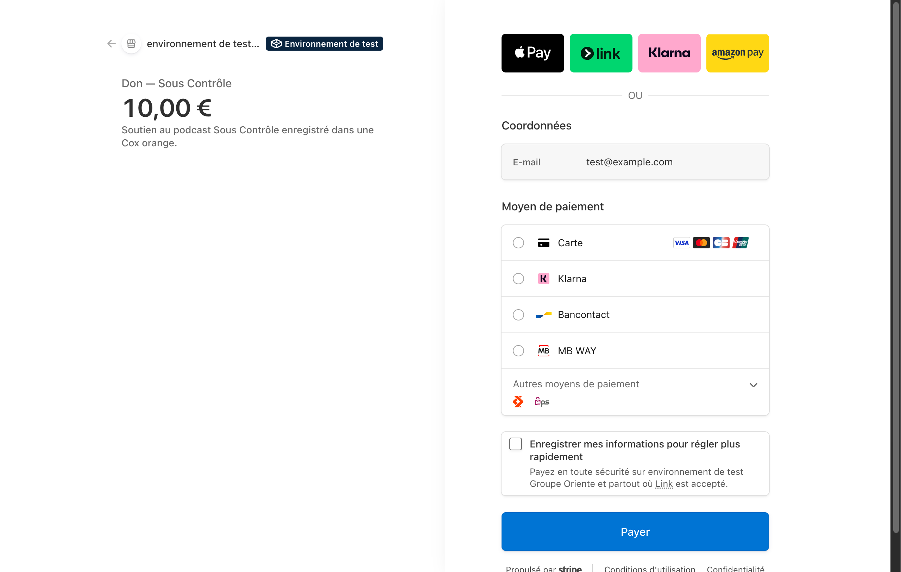

# Preuves — Mise en production d'un paiement en ligne et passation documentée au client

✅ **Existe** — quatre captures publiées sur [https://yanis-haddou.vercel.app/stages](https://yanis-haddou.vercel.app/stages) :

- [x] Don ponctuel par Stripe sur le site du podcast
- [x] Tunnel sponsor : emplacements disponibles et tarifs
- [x] Page sponsor
- [x] **Page de paiement Stripe en environnement de test** — la capture porte le bandeau « Environnement de test », ce qui est honnête et vaut mieux qu'une fausse transaction présentée comme réelle

À joindre : la documentation de passation, si elle est écrite.

## Aperçu visuel

*Le don ponctuel, en production sur le site public.*

*Les emplacements sponsor et leurs tarifs.*

*La page de paiement, avec son bandeau « Environnement de test ». Elle
est montrée telle quelle : une fausse transaction présentée comme réelle
ne tiendrait pas une question du jury.*
